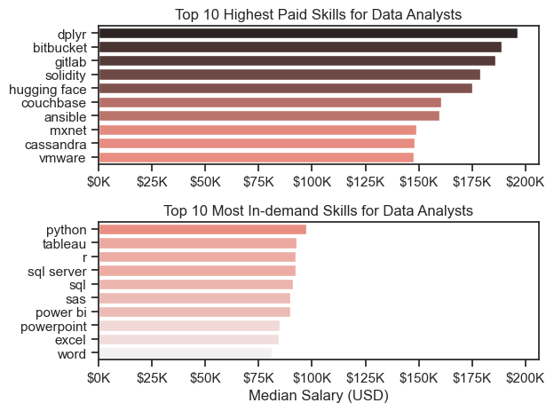

# Introduction
Hi! Welcome to my analysis of the 2023 data job market, mostly focusing on the specific role of data analyst. The goal of this project is to better navigate the job market by examining in-demand skills, top-paying opportunities and projecting career paths to uncover the best opportunities for data analysts.

This is my first ever Python project as I'm learning how to program with Python. It allows me to walk through all the fundamentals and apply them while exploring real-world data analysis tasks. 

The data source is from [Python Lesson by Luke Barousse](https://www.lukebarousse.com/python), which sets the foundation for my analysis by providing detailed information on job titles, salaries, locations, essential skills, and even posted time. By using Python scripts, I investigate key questions, including the most demanded skills, salary trends, and how demand and salary interact within the data analytics field.

# Questions
## Here are some questions I have and want to answer while going through this dataset:
 1. What are the must-have skills for the top 3 trending data roles?
 2. How are the top skills trending for Data Analyst?
 3. How well do jobs and skills pay Data Analyst?
 4. What is the most optimal skill to learn for Data Analyst?
 5. What is the projected career path and salary for a Data Analyst?


# Tools I Learned and Used in this Project
## In order to dig deeper into this dataset, it is necessary to first develop the ability to wield these essential skills.

#### 1. Python: The core of my analysis, enabling me to process the data and uncover key insights.
-  Pandas Library: Used for data manipulation and analysis.

-  Matplotlib Library: Helped me create visualizations of the data.

-  Seaborn Library: Helped me create more advanced visualizations of the data.

#### 2. Jupyter Notebooks: The platform I used for running Python scripts, making it easy to integrate notes and track my analysis.

#### 3. Visual Studio Code:My go-to code editor for writing and running Python scripts.

#### 4. Git & GitHub: Essential tools for version control, sharing my work, and collaborating on projects.

# Data Setup and Cleanup

## To ensure all analyses are consistently accurate, the following section outlines the code setup for the analysis:

#### 1. Import All Necessary Libraries
```python
import pandas as pd
import ast
import numpy as np
import matplotlib.pyplot as plt
import seaborn as sns
```

#### 2. Dataset and Data Loading with Date-Time Handling
```python
from datetime import datetime
from datasets import load_dataset
dataset = load_dataset('lukebarousse/data_jobs')
df = dataset['train'].to_pandas()
```
#### 3. Data Cleanup
```python
df['job_posted_date'] = pd.to_datetime(df['job_posted_date'])
df['job_skills'] = df['job_skills'].apply(lambda date: ast.literal_eval(date) if pd.notna(date) else date)
```

#### 4. Filter US Jobs
```python
df_us = df[df['job_country'] == 'United States']
```
**This analysis project is mostly focusing on jobs in the US.*

# The Analysis

## 1. What are the key skills for the top 3 trending data roles?

### Thought Process 
To identify the top 3 most popular data roles, I filtered positions based on market demand, and then selected the top 5 skills associated with these roles. 
This query emphasizes the most popular job titles and their key skills, helping me identify which skills to focus on based on the role I'm aiming for.

Detailed steps click here to view:
[2_Skill_Demand.ipynb](3_Project/2_Skill_Demand.ipynb)

### Visualizing Data
```python
fig, ax = plt.subplots(len(job_titles), 1)

for i, title in enumerate(job_titles):
    df_plot = df_skills_count[df_skills_count['job_title_short'] == title].head(5)
    df_plot[::-1].plot(kind='barh', x='job_skills', y='skill_count', ax=ax[i], title=title)
    ax[i].set_xlabel('')
    ax[i].set_ylabel('')
    ax[i].legend().set_visible(False)
    
fig.suptitle('Count of Top Skills in Top 3 trending Roles', fontsize=15)
fig.tight_layout()
plt.show()
```
### Results


*Bar Graph Visualizes the salary for the top 3 data roles with each of their top 5 correlated skills in percentage*

### Takeaways
- SQL is the most requested skill for 2 of the 3 roles, the second most requested for the third role, and is requested as an essential skill in over 50% of the job postings for all three roles (Analyst: 51%, Engineer: 68%, Scientist: 51%), making it the most demanded skill among the three roles.
- Python is also dominating as an essential programming skill, ranking as the top programming skill for all three roles with different functions. Over 60% of job postings for Data Engineers (65%) and Data Scientists (72%) require this skill, while it is the 4th most requested skill for Data Analysts."
- Although all three roles require a combination of data programming (Python) and management (SQL) skills, Data Engineers also requires more specialized skills (including AWS, Azure, Spark)

## 2. How are the top skills trending for Data Analysts in the US?

### Thought Process 
To identify the top trending skills for Data Analysts in 2023, I filtered data analysts roles by the month of the job posting.
This query provides the top 5 skills that are trending through 2023.

Detailed steps click here to view:
[3_Skills_Trend.ipynb](3_Project/3_Skills_Trend.ipynb)

### Visualizing Data
```python
from matplotlib.ticker import PercentFormatter
ax = plt.gca()
ax.yaxis.set_major_formatter(PercentFormatter(decimals=0))

for i in range(5):
    y_position = df_us_da_plot.iloc[-1, i]
    
    if df_us_da_plot.columns[i] == 'python':
        y_position += 2
    elif df_us_da_plot.columns[i] == 'tableau':
        y_position -= 2 
    
    plt.text(
        11.2, y_position, 
        df_us_da_plot.columns[i], 
        va='center', 
        ha='left'
    )

```
### Results

*Line graph visualizes the trending top skills for data analysts in the US in 2023.*

### Takeaways
- SQL, as a data management skill, continues to define Data Analyst roles, trending in over 50% of job postings across three quarters and maintaining its prominence by ranking as the top skill for Data Analysts throughout 2023.
- Excel is still a highly demanded skill due to its widespread accessibility and versatility.
- Python and Tableau are showing stable demand throughout the year, Although Sas is showing similar trend, its demand is lower than Python and Tableau by 5 to 10 %, or even more throughout the year.


## 3. How Well do jobs and salary pay for Data Analysts?

### Thought Process 
First, to spot the highest-paying roles, I analyzed the median salaries for positions like Data Analyst, Data Engineer, and Data Scientist, and identify which role has the highest pay.

Detailed steps click here to view:
[4_Salary_Analysis.ipynb](3_Project/4_Salary_Analysis.ipynb)

### Visualize Data

```python
sns.barplot(data=df_da_top_pay, x='median', y=df_da_top_pay.index, ax=ax[0], hue='median', palette='dark:salmon_r')

sns.barplot(data=df_DA_skills, x='median', y=df_DA_skills.index, hue='median', ax=ax[1], palette='light:b')

plt.show()

```

### Results


*Box Plot visualizes the distributions of salary for the top 6 data job titles*

### Takeaways
- Senior Data Scientists have the highest salary among all three senior roles, including the outliers.
- The annual salary range for Data Engineers and Data Scientists is higher than that of Senior Data Analysts, suggesting that the skills required for Engineers and Scientists could be more technical.
- Data Scientists not only have the broadest IQR but also the most extreme outliers (~600k).

## Analyzing Top-Paying Skills & Most Demanded Skills
Second, I focused on Data Analyst roles and examined the highest-paid skills, as well as the most in-demand skills, showcasing them with two separate bar charts.

### Visualize Data

```python
sns.boxplot(data=df_us_top6, x='salary_year_avg', y='job_title_short', order = job_order_list)
plt.title('Salary Distribution in the United Stats')
plt.xlabel('Yearly Salary ($USD)')
plt.ylabel('')
ax = plt.gca()
ax.xaxis.set_major_formatter(plt.FuncFormatter(lambda x, pos: f'${int(x/1000)}K'))
plt.xlim(0, 600000)
plt.show()
```

#### Results


*Box Plot visualizes the distributions of salary for the top paid skills and top demanded skills*

### Takeaways
- The top bar shows that specialized technical skills, such as dplyr, Bitbucket, and Gitlab, are correlated with higher salaries, with some reaching up to $200K. This suggests that advanced technical skills can enhance salary potential.
- The bottom bar illustrates that Python is the highest-paying skill among the top 10 most in-demand skills, making it the most valuable skill for Data Analysts.
- Microsoft skills, such as PowerPoint, Excel, and Word, appear at the bottom of the list, suggesting that while these skills are widespread, their value is diminished for Data Analysts.
- There’s a clear difference between the highest-paying skills and the most in-demand ones. To boost career potential, Data Analysts should aim to build a diverse skill set that includes both high-paying specialized skills and widely recognized foundational skills.

## 4. What is the most Optimal skill to learn for Data Analyst?

### Thought Process 
To pinpoint the best skills for Data Analysts (those that are both the highest paid and most in demand), I calculated the demand percentage and median salary for each skill, making it easier to identify the most valuable skills to learn.

Detailed steps click here to view:
[5_Optimal_Skills.ipynb](3_Project/5_Optimal_Skills.ipynb)

#### Visualize Data

```python
from adjustText import adjust_text
from matplotlib.ticker import PercentFormatter
sns.scatterplot(
    data=df_plot, 
    x='skill_percent',
    y='median_salary',
    hue='technology'
)
plt.show()

```

#### Results


*Scatter Plot visualizes the most optimal skills for data analysts in the US*

### Takeaways
Skill Analysis:
- `Python` offers a higher average salary (~98K) but is requested in only about 30% of Data Analyst job postings, indicating that while it can lead to better pay, it’s not as frequently required.
- On the contrary, `SQL` has a slightly lower average salary (~91K) but dominates the demand, appearing in nearly 60% of Data Analyst job postings, emphasizing its critical role in securing a position in the field.
- Although the salary for `Oracle` is only slightly lower than Python, job postings request it in only approximately 5% of cases, highlighting the fact that specialized technical skills are highly valued for Data Analysts.

Technology Analysis
- The scatter plot reveals that most programming skills (in blue) cluster around the higher salary range, suggesting that programming can lead to better pay for Data Analysts.
- Analyst tools (in green), such as Tableau and Power BI, are commonly listed in job postings and come with competitive salaries. These tools are essential for today’s data roles, offering both versatility and value across a range of data-related tasks.

## 5. What is the projected career path and salary for a Data Analyst?

### Thought Process 


Detailed steps click here to view:
[6_Data Analyst_career_path_Analysis.ipynb](3_Project/6_Data Analyst_career_path_Analysis.ipynb)

#### Visualize Data

```python


```

#### Results


**

### Takeaways


# What I learned

# Challenges I Encountered

# General Insights

# Conclusions